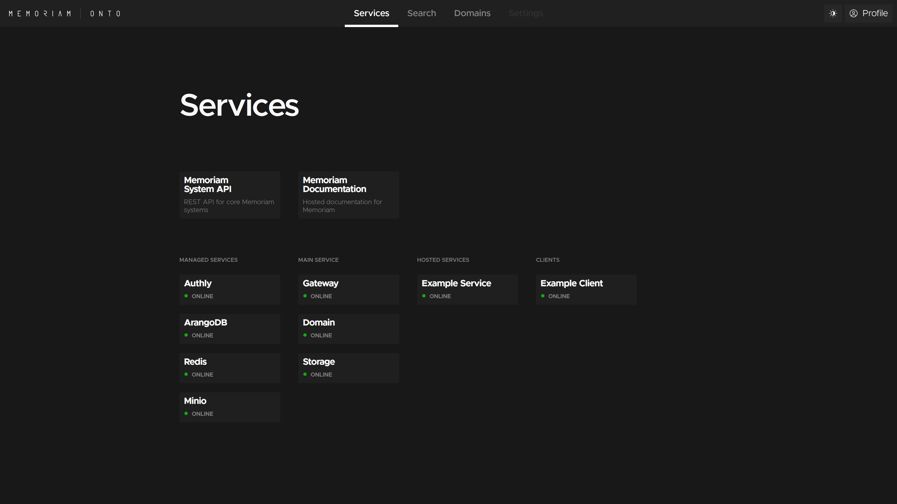

# Quickstart


## Running Memoriam

Memoriam relies on a small set of components to run, and the recommended way of running it is with Docker or Kubernetes.


### Docker

Memoriam is available as a single [Docker image](https://hub.docker.com/r/protojour/memoriam), and has a command-line interface:

```
$ docker run protojour/memoriam

Usage: memoriam [OPTIONS] COMMAND [ARGS]...

  Open analytical data warehouse platform

Options:
  --help  Show this message and exit.

Commands:
  gateway  Run memoriam in Gateway mode
  domain   Run memoriam in Domain mode
  storage  Run memoriam in Storage mode
  config   Export default configs
```

But you won't get very far without a bit of configuration, and few more services running at once.

Configuration is documented in detail in the section [Configuring Memoriam](configuration.md). Memoriam will run without additional configuration, but it won't do much.

Base configuration files can be exported using the `memoriam config` command, and edited according to your needs:

```
$ docker run protojour/memoriam config

Usage: memoriam config [OPTIONS]

  Export default configs

Options:
  --db_schema  Export default database schema in YAML format
  --index      Export default index config in YAML format
  --search     Export default search config in YAML format
  --service    Export default service config in YAML format
  --logging    Export default logging config in YAML format
  --help       Show this message and exit.
```

You can redirect the output to a file, e.g.:

```bash
docker run protojour/memoriam config --db_schema > db_schema.yml
```

Memoriam itself has a layered architecture, and needs three instances, running in three different modes:

- **Gateway mode**, which serves as the external entrypoint. The Gateway handles authentication and reverse proxy requests to the Domain and Storage layers.
- **Domain mode**, which serves the core Memoriam System API and generated REST or GraphQL APIs for configured domains. It also manages services.
- **Storage mode**, which provides isolated access to database and object storage APIs. Access control to data is enforced at this level.

Memoriam usually requires the following additional services:

- An [Authly](https://software.situ.net/authly/docs/) server for identity and access manangement
- An [ArangoDB](https://www.arangodb.com/) database, single instance or cluster.
- A Redis-compatible key-value store for for caching and worker synchronization, e.g. [ValKey](https://valkey.io/). Authly also uses Redis.
- An S3-compatible service for object storage, e.g. [MinIO](https://min.io/)


#### docker-compose

A very minimal sample docker-compose file is given below. We recommend using TLS for the Gateway and Authly for authentication and access management _at the very least_.

This setup would need a corresponding Authly operations script, see [authentication and authorization](authentication-and-authorization.md). The `search_config.yml` is detailed [here](search-configuration.md), and the `db_schema.yml` is detailed [here](database-schemas.md).

In a production setting, only the Gateway should be exposed to the internet, and the Domain and Storage layers kept on respective separate (virtual) networks. The database and storage services should be set up with their own authentication, see [environment variables](environment-variables.md).

```yaml
---
version: '3.5'
services:

  memoriam-gateway:
    image: protojour/memoriam:latest
    environment:
      HOST_DOCS: 1
      GATEWAY_TLS: 1
      AUTHLY_SERVICENAME: memoriam
      AUTHLY_SERVICESECRET: secret
      CERT_FILE: /srv/memoriam/server.pem
      KEY_FILE: /srv/memoriam/server.key
    volumes:
      - ./server.pem:/srv/memoriam/server.pem:ro
      - ./server.key:/srv/memoriam/server.key:ro
    ports:
      - 5001:5001
    command: memoriam gateway

  memoriam-domain:
    image: protojour/memoriam:latest
    environment:
      REDIS_HOST: valkey
      AUTHLY_SERVICENAME: memoriam
      AUTHLY_SERVICESECRET: secret
      SEARCH_CONFIG_PATH: /srv/memoriam/search_config.yml
    volumes:
      - ./search_config.yml:/srv/memoriam/search_config.yml:ro
    command: memoriam domain

  memoriam-storage:
    image: protojour/memoriam:latest
    environment:
      REDIS_HOST: valkey
      AUTHLY_SERVICENAME: memoriam
      AUTHLY_SERVICESECRET: secret
      ARANGO_SCHEMA_PATH: /srv/memoriam/db_schema.yml
      SEARCH_CONFIG_PATH: /srv/memoriam/search_config.yml
    volumes:
      - ./db_schema.yml:/srv/memoriam/db_schema.yml:ro
      - ./search_config.yml:/srv/memoriam/search_config.yml:ro
    command: memoriam storage

  authly:
    image: protojour/authly:latest
    environment:
      PORT: 5004
      REDIS_ADDRESSES: valkey:6379

  arangodb:
    image: arangodb:3.11
    environment:
      ARANGO_NO_AUTH: 1

  valkey:
    image: valkey/valkey:7.2-alpine

  minio:
    image: minio/minio:latest
```


### Kubernetes

TBA


## Onto

With Memoriam up and running, you'll have access to the Onto frontend client at `<gateway_url>/onto`. If you have authentication with Authly set up, you will first have to log in.



The Services dashboard provides an overview of the Memoriam service mesh. You should be able to see the required services (as defined above), as well as any services included through the [service configuration](service-configuration.md). Services are health-checked, and all of them should have a green mark and the text "Online". If this is not the case, check log outputs for any errors!

You can use the Search to explore data stored in Memoriam, but you likely won't have any data yet. First you will have to define a [database schema](database-schemas.md) and at least one domain.


## Domains

Domains are core to how Memoriam manages data. A domain is an information model, and provides a namespaced abstraction and/or transformation of raw data as found in the database. You might have a core domain, representing your core data model. You might have another custom domain for a frontend client, referencing the core domain, or a domain built to interface with some external service, translating concepts and transforming data along the way.

Domains can be created, edited and explored through Onto. Refer to the documentation on [domain schemas](domain-schemas.md) to learn how to build them.


## API overview

APIs are exposed through the Gateway on the following paths:

- `/health` – Health check
- `/onto` – Onto client
- `/docs` – Hosted documentation, if activated
- `/authly/api` – Authly authentication services
- `/system/api` – Memoriam System REST API, OpenAPI client & docs
- `/<domain>/api` – Generated Domain REST API, OpenAPI client & docs
- `/<domain>/graphql` – Generated Domain GraphQL API, GraphQL explorer client & docs
- `/_db` – Reverse proxied low level ArangoDB HTTP API access for services
- `/_api` – Reverse proxied low level ArangoDB HTTP API access for services
- `/_admin` – Reverse proxied low level ArangoDB HTTP API access for services

Memoriam's System API is available at `<gateway_url>/system/api`. The OpenAPI spec provides detailed documentation on how to interact with Memoriam core systems.
